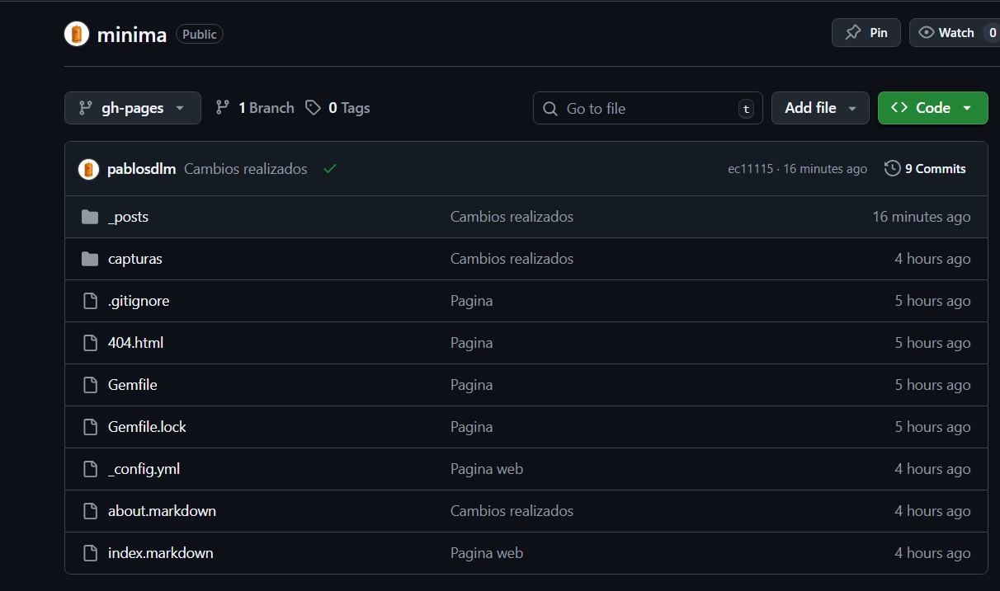
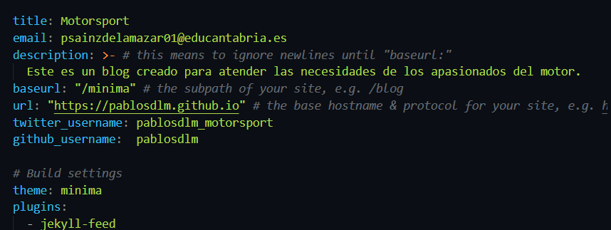
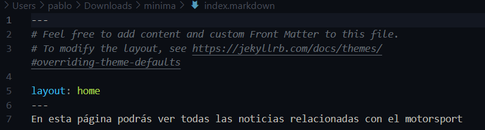
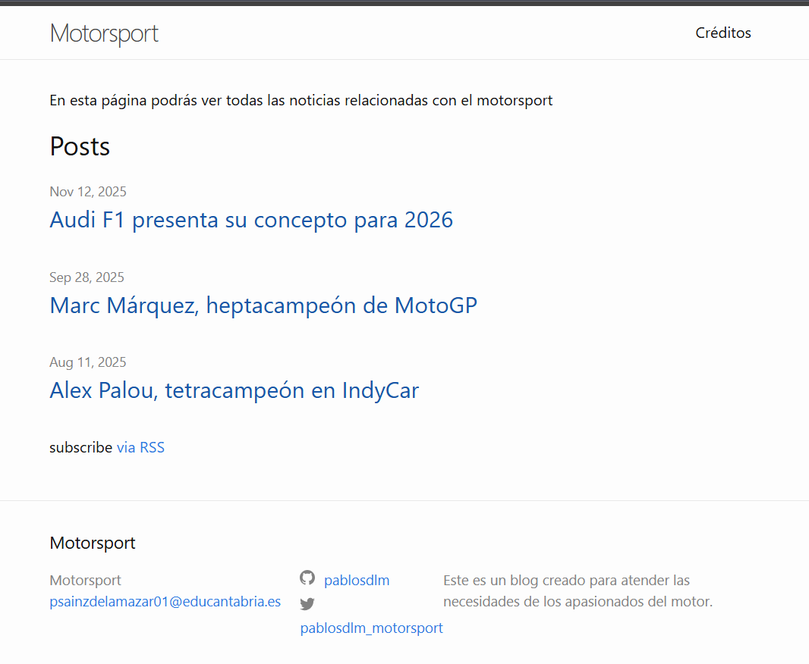
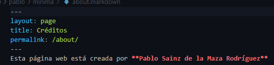
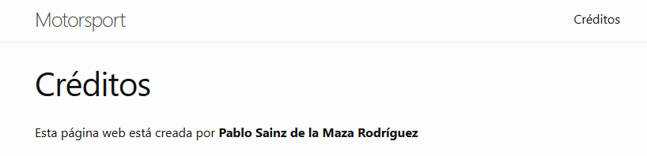
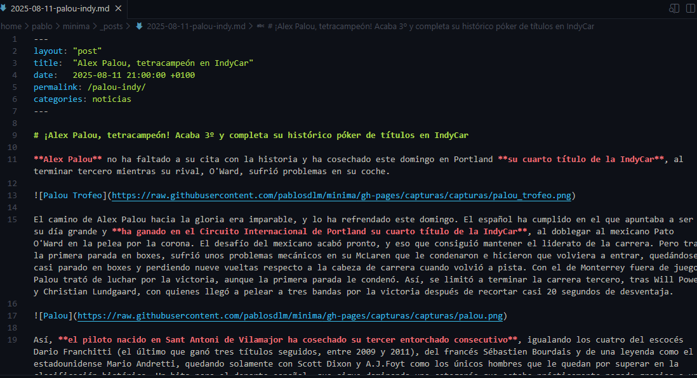

# Ejercicio 1: Jekyll con tema minima
## Requisitos previos
Para hacer este ejercicio, debemos instalar ruby para poder instalar Jekyll con los siguientes comandos:

`sudo apt-get install ruby-full build-essential zlib1g-dev`

`echo '# Install Ruby Gems to ~/gems' >> ~/.bashrc`

`echo 'export GEM_HOME="$HOME/gems"' >> ~/.bashrc`

`echo 'export PATH="$HOME/gems/bin:$PATH"' >> ~/.bashrc`

`source ~/.bashrc`

Para instalar Jekyll:

`gem install jekyll bundler`

## 1. Creación del sitio
Para crear los archivos del sitio, debemos crear un directorio para guardar el sitio `mkdir`. Cuando hayamos creado el directorio, iniciaremos el sitio usando el comando `jekyll new .` y tener todos los archivos que compondran el sitio.

## 2. Creación del repositorio en Github
Tras crear los archivos necesarios para crear el sitio con Jekyll, debemos crear un repositorio en Github para almacenar los archivos, subirlos y poder desplegarlos en **Github Pages**. Después de crear el repositorio, ejecutamos los siguientes comandos para vincular el directorio con el repositorio:

```bash
git init
git remote add origin "token"
```



## 3. Configuración del sitio (_config.yml)
Una vez hechos los pasos anteriores, debemos configurar el sitio. En cuanto a los apartados importantes, tenemos el apartado **title**, en el que configuramos el título que tendrá la página. En **baseurl**, debemos usar el nombre del repositorio para que no se mezcle con otros repositorios que estén desplegados en **Github Pages**. En **URL**, hay que especificar en qué dirección se debe desplegar, de tal forma que la URL completa quedaría: [https://pablosdlm.github.io/minima](https://pablosdlm.github.io/minima)



## 4. Configuración del índice o página principal (index.markdown)
*index.markdown* es el archivo en el que podemos editar para indicar el mensaje que se muestra en la página principal.



Esta es la vista que tenemos cuando está desplegada en Github Pages:


## 5. Configuración del about o Sobre mí (about.markdown)
*about.markdown* es el archivo que muestra la información sobre la página o sobre el creador de dicha página.   
En mi caso, mi *about.markdown* indica quién la ha creado.



Esta es la vista que tenemos cuando está desplegada en Github Pages:



## 6. Posts
Los posts son las publicaciones que tendrá nuestro sitio. En ellas, podemos publicar noticias indicando la fecha de esta. Estos posts quedan almacenados en **_posts** escritos en **Markdown** o en **HTML**. El título del archivo debe ser `año-mes-dia-titulo-del-post.md`.


Para crear los posts, debemos crear un archivo en Markdown o HTML e introducir la cabecera *(frontmatter)* que especifica el tipo de archivo que es, es decir, que indique si es un **post, about, home...**
### Post de ejemplo
El *frontmatter* es lo que se encuentra entre guiones. Cabe destacar que los *frontmatter* sirven para cualquier markdown usado en Jekyll como el *index.markdown* o *about.markdown*.

| Layout | Title | Date | Permalink | Categories |
| :--------: | :--------: | :--------: | :--------: | :--------: |
| Plantilla de Jekyll | Título del post | Fecha del post | Dirección para mostrar el post | Clasificación del post |



## Subida a Github Pages
Una vez esté acabada la configuración del sitio y su personalización, se harán los siguientes comandos para subir los archivos a Github y que se muestren en Github Pages:

```bash
git add .
git commit -m 
git push origin gh-pages
```