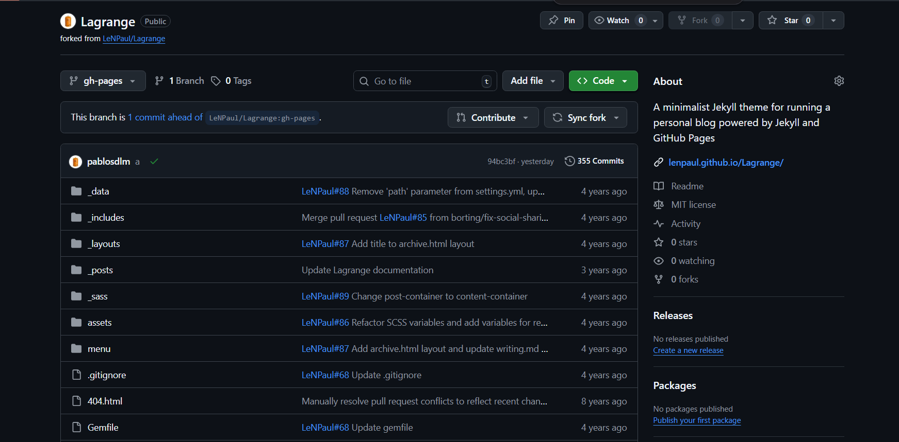
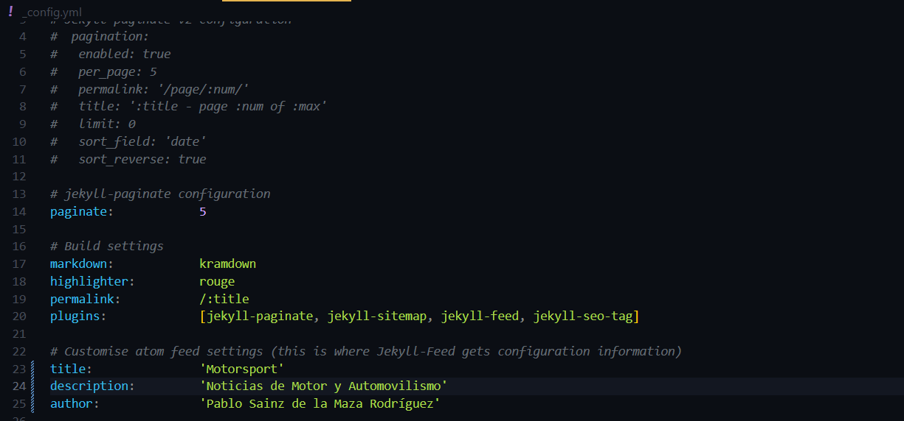
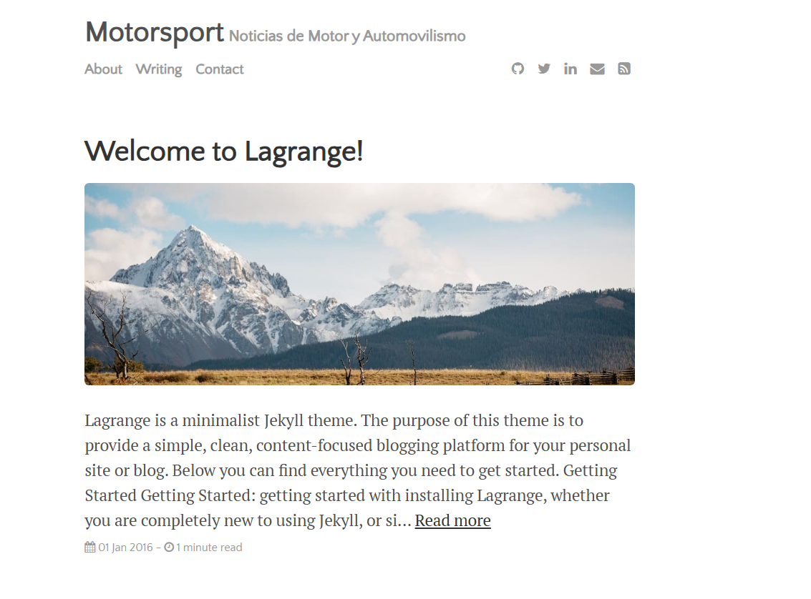
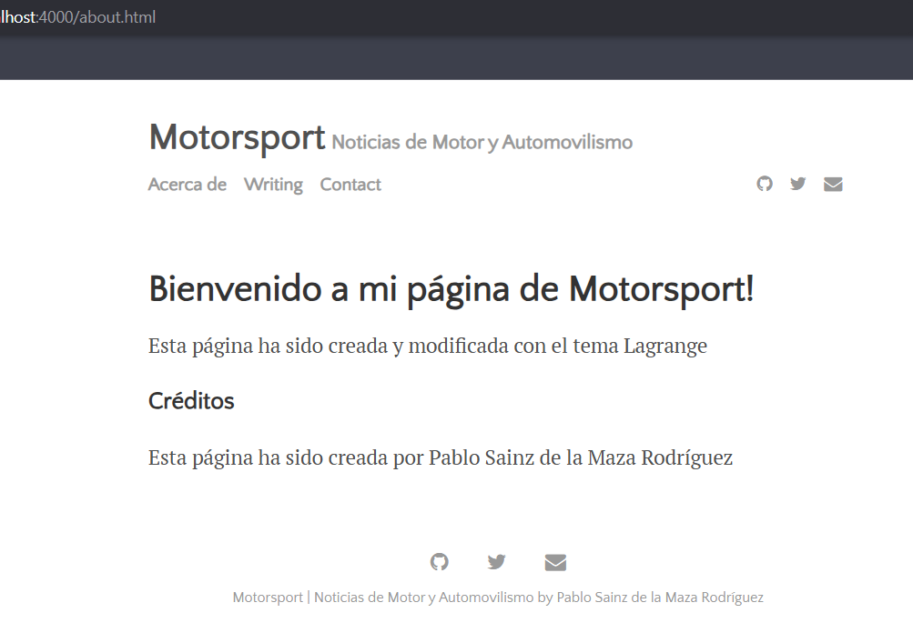

# Ejercicio 2: Jekyll con tema Lagrange
## 1. Importar el tema Lagrange a mi cuenta de Github
Para poder usar el tema Lagrange, debemos ir al repositorio de Github de Lagrange creado por LeNPaul y hacer un fork para poder tener su repositorio en nuestra cuenta de Github. Luego debemos clonar el fork en nuestra máquina virtual usando `git clone` junto el token para convertirlo en remoto.



## 2. Configuración principal o Configuración del sitio (_config.yml)
En el fichero **_config.yml**, tenemos toda la configuración del sitio, como cambiar el título del sitio *title*; la descripción del sitio *description*; los plugins que se pueden emplear para modificar el funcionamiento del sitio *plugins* o el autor del sitio *author*.


*En vista del cliente, el parámetro **author** se aprecia en la parte inferior del sitio*


## 3. Modificar o añadir posts
En cuanto a los **posts**, estos se muestran en la página principal. En su archivo de Markdown, siguen la misma estructura *(frontmatter)* que con el tema *minima*
Estos posts quedan almacenados en **_posts** escritos en **Markdown** o en **HTML**. El título del archivo debe ser `año-mes-dia-titulo-del-post.md`, al igual que con el tema **minima**.


## 4. Modificación de Acerca de o About me (about.md)
En los sitios web, se suele incluir un apartado sobre la información del sitio o la información del creador de dicho sitio. Esto se edita mediante el archivo *about.md* en `/menu/about.md`. Mantiene el mismo *frontmatter* que el tema **minima**.

Así se ve **about**.


## 5. Finalización
Para subir los cambios a **Github Pages**, se usarán los siguientes comandos:
```bash
git add .
git commit -m
git push origin gh-pages
```