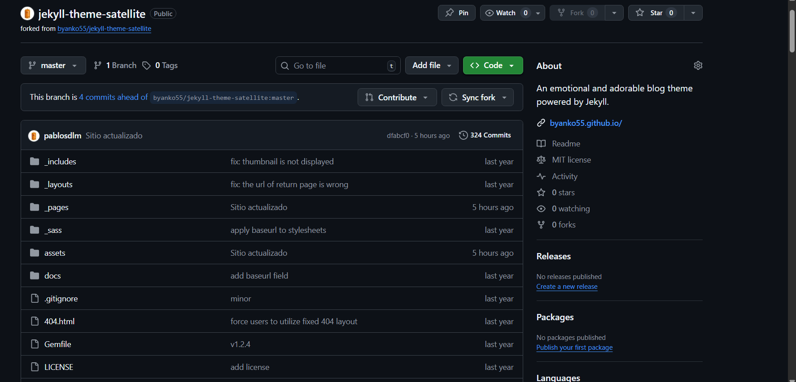
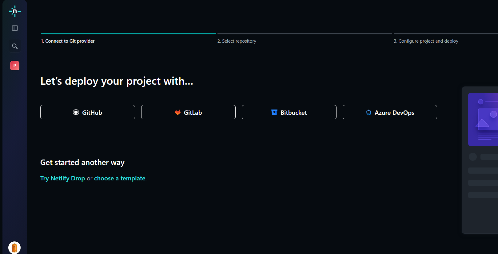
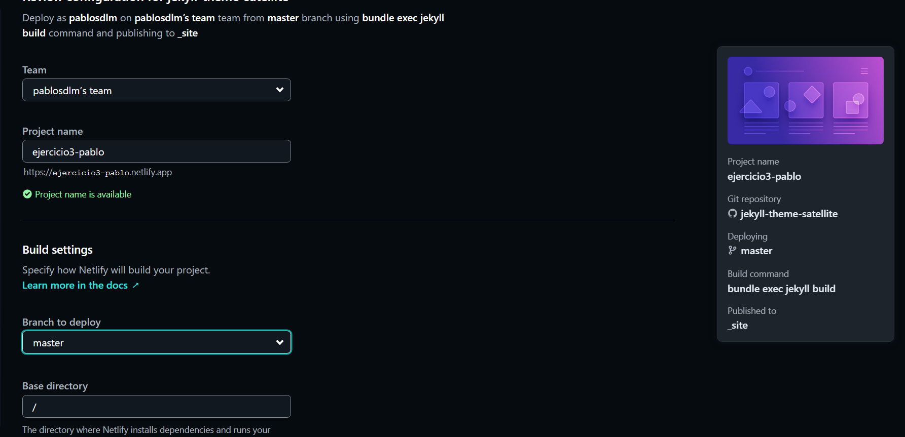
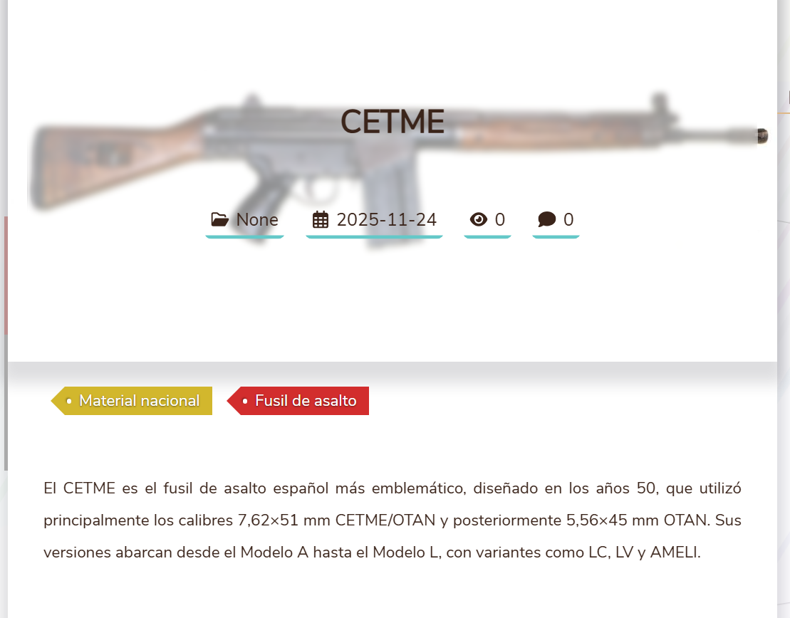

# Ejercicio 3: Escoger un tema de Jekyll y despliegue en Netlify

## 1. Obtener el tema
Para este ejercicio, he escogido el tema **Satellite**. Para poder usarlo, hay que hacerle un fork desde su propio repositorio y traerlo a nuestra cuenta.



## 2. Preparación del sitio en Netlify
Para poder desplegar el sitio en Netlify, tenemos que iniciar sesión y darle a **añadir un nuevo projecto**. Nos preguntará cómo crear desplegar el proyecto, es decir, si queremos usar distintas plataformas para importar el repositorio y usaremos **Github**, seleccionamos el repositorio del tema al que hemos hecho fork.



Por último, debemos poner un nombre al proyecto que servirá para complementar la URL del sitio y poner un directorio base poniendo una /. En cuanto a la rama, dejamos la que viene por defecto.



## 3. Configuración del tema (_config.yml)
La configuración del tema contiene los datos que se tienen que mostrar en la página, como el título, el icono o las redes sociales que se muestran como información.
```yaml
title: armerias.com
description: "Armados hasta los dientes"
logo_img: "/assets/img/logo.png"
profile_img: "/assets/img/logo.png"

# Social Links
email: psainzdelamazar01@educantabria.es
github_username: pablosdlm
twitter_username: twitter
instagram_username: instagram
linkedin_username: linkedin
facebook_username: facebook
```

# 4. Posts
Los posts en este tema se encuentran ubicados en el directorio **_posts**. Estos posts también usan un *frontmatter* como en los otros temas. Esto son algunos ejemplos:

```yaml
---
title: "CETME"
tags:
    - Material nacional
    - Fusil de asalto
date: "2025-11-24"
thumbnail: "/assets/img/thumbnail/cetme-logo.png"
bookmark: true
---
El CETME es el fusil de asalto español más emblemático, diseñado en los años 50, que utilizó principalmente los calibres 7,62×51 mm CETME/OTAN y posteriormente 5,56×45 mm OTAN. Sus versiones abarcan desde el Modelo A hasta el Modelo L, con variantes como LC, LV y AMELI.
```
- Title funciona para el título
- Tags sirve para clasificar el post.
- Date es la fecha.
- Thumbnail sirve para mostrar una miniatura

# 4.1 Inclusión de imágenes
Para incluir imágenes dentro del sitio, deben estar colocadas en `/assets/img`

### Ejemplo de post



# 5. Despliegue del sitio
Para desplegar el sitio en **Netlify**, hay que tener **Git** instalado y ejecutar los siguientes comandos:
```bash
git add .
git commit
git push origin master
```
Después de ejecutar estos comandos, **Netlify** desplegará el sitio ejecutando internamente el comando `bundle exec jekyll serve`